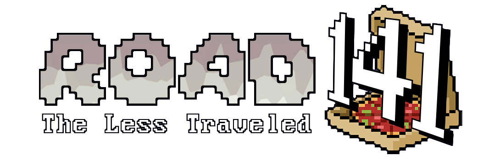

<h1 align="center">Road 141 🍕 </h1>
<a id="readme-top"></a>

[![Contributors][contributors-shield]][contributors-url]
[![Forks][forks-shield]][forks-url]
[![Stargazers][stars-shield]][stars-url]
[![Issues][issues-shield]][issues-url]
[](https://github.com/kiloumanjaro/Road141/blob/main/LICENSE)
[![LinkedIn][linkedin-shield]][linkedin-url]

<!-- PROJECT LOGO -->
<div align="center">
  <a href="https://github.com/kiloumanjaro">
    
  </a>
  <br />
  <p align="center">
    <br />
    <p align="center">
      <a href="#"></a>
      <a href="https://www.python.org"></a>
      <a href="https://github.com/kiloumanjaro/Road141/commits/main">
    </p>
    <a href="https://github.com/kiloumanjaro/Road141/issues/new?labels=bug&template=bug-report---.md">Report Bug</a>
    &middot;
    <a href="https://github.com/kiloumanjaro/Road141/issues/new?labels=enhancement&template=feature-request---.md">Request Feature</a>
  </p>
</div>

<!-- TABLE OF CONTENTS -->
<details>
  <summary>Table of Contents</summary>
  <ol>
    <li>
      <a href="#-project-overview">📋 Project Overview</a>
      <ul>
        <li><a href="#-built-with">💪🏼 Built With</a></li>
      </ul>
    </li>
    <li><a href="#%EF%B8%8F-gameplay">⏱️ Gameplay</a></li>
    <li>
      <a href="#-getting-started">💻 Getting Started</a>
      <ul>
        <li><a href="#-prerequisites">🔧 Prerequisites</a></li>
        <li><a href="#%EF%B8%8F-installation">🛠️ Installation</a></li>
        <li><a href="#%EF%B8%8F-running-the-application">▶️ Running</a></li>
      </ul>
    </li>
    <li><a href="#-notes">📝 Notes</a></li>
    <li><a href="#-contributing">📬 Contributing</a></li>
    <li><a href="#%EF%B8%8F-license">⚖️ License</a></li>
  </ol>
</details>

<!-- PROJECT OVERVIEW -->

## 📋 Project Overview

Sonic-inspired side-scrolling platformer that is implemented using [Kaplay.js](https://kaplayjs.com) combining fast-paced arcade gameplay with core concepts from automata theory and formal languages.

> [!NOTE]
> 
> This game was submitted as a final project for the subject *CMSC 141 - Automata Theory and Formal Languages*. It aims to creatively apply theoretical computer science concepts in an interactive and engaging way

### 💪🏼 Built With

[![HTML5][HTML5]][HTML5-url]
[![CSS3][CSS3]][CSS3-url]
[![JavaScript][JavaScript]][JavaScript-url]

<!-- SCREENSHOTS -->

## ⏱️ Gameplay
> _For more examples, please refer to the [Documentation](https://www.canva.com/design/DAGpN1rpWb8/dXdLFQqx2HX04MWnI-riIw/view?utm_content=DAGpN1rpWb8&utm_campaign=designshare&utm_medium=link2&utm_source=uniquelinks&utlId=h1697f46d55) or play it on [Itch.io](https://kiloumanjaro.itch.io/road141) or [GitHub](https://kiloumanjaro.github.io/Road141/)_

https://github.com/user-attachments/assets/e573103f-eb64-462b-9f57-d0363fe8065c
<div align="center">
  
  
</div>

<!-- GETTING STARTED -->

## 💻 Getting Started

Follow these steps to get Road 141 running on your local machine.

### 🔧 Prerequisites

- Node.js (version 16.0 or higher)
- npm or yarn
- Modern Browser (w/ WebGL)

### 🛠️ Installation

#### 1. Clone the Repository

```sh
git clone https://github.com/kiloumanjaro/Road141.git
cd Road141
```

#### 2. Install Dependencies
```sh
# Install project dependencies
npm install
```

### ▶️ Running the Application

```sh
npm run dev
```

> [!WARNING]
> 
> Some mobile browsers may have reduced performance and audio may not autoplay on some browsers due to autoplay policies

## 📝 Notes

- Module not found errors: Try deleting node_modules and package-lock.json, then run npm install again
- The game will be available at http://localhost:5173 (or another port if 5173 is busy)
- Assets are automatically optimized during the build process

<!-- CONTRIBUTING -->

## 📬 Contributing

If you have a suggestion that would make this better, please fork the repo and create a pull request. You can also simply open an issue with the tag "enhancement".
Don't forget to give the project a star! Thanks again!

1. Fork the Project
2. Create your Feature Branch (`git checkout -b feature/AmazingFeature`)
3. Commit your Changes (`git commit -m 'Add some AmazingFeature'`)
4. Push to the Branch (`git push origin feature/AmazingFeature`)
5. Open a Pull Request

### 📢 Contributors

<a href="https://github.com/kiloumanjaro/Road141/graphs/contributors">
  
</a>

<!-- LICENSE -->

## ⚖️ License

This project is licensed under the Unlicense License - see the [LICENSE](LICENSE) file for details.


<!-- MARKDOWN LINKS & IMAGES -->
<!-- https://www.markdownguide.org/basic-syntax/#reference-style-links -->

[contributors-shield]: https://img.shields.io/github/contributors/kiloumanjaro/Road141.svg?style=for-the-badge
[contributors-url]: https://github.com/kiloumanjaro/Road141/graphs/contributors
[forks-shield]: https://img.shields.io/github/forks/kiloumanjaro/Road141.svg?style=for-the-badge
[forks-url]: https://github.com/kiloumanjaro/Road141/network/members
[stars-shield]: https://img.shields.io/github/stars/kiloumanjaro/Road141.svg?style=for-the-badge
[stars-url]: https://github.com/kiloumanjaro/Road141/stargazers
[issues-shield]: https://img.shields.io/github/issues/kiloumanjaro/Road141.svg?style=for-the-badge
[issues-url]: https://github.com/kiloumanjaro/Road141/issues
[linkedin-shield]: https://img.shields.io/badge/-LinkedIn-black.svg?style=for-the-badge&logo=linkedin&colorB=555
[linkedin-url]: https://www.linkedin.com/in/kiloumanjaro/overlay/urn:li:fsd_profileProject:(ACoAAFzjJQAB9x0aScdtku_x1uEPQArwlLGW7CQ,654846075)/skill-associations-details/
[product-screenshot]: images/screenshot.png
[HTML5]: https://img.shields.io/badge/HTML5-E34F26?style=for-the-badge&logo=html5&logoColor=white
[HTML5-url]: https://developer.mozilla.org/en-US/docs/Web/Guide/HTML/HTML5
[JavaScript]: https://img.shields.io/badge/JavaScript-F7DF1E?style=for-the-badge&logo=javascript&logoColor=black
[JavaScript-url]: https://developer.mozilla.org/en-US/docs/Web/JavaScript
[CSS3]: https://img.shields.io/badge/CSS-1572B6?style=for-the-badge&logo=css&logoColor=fff
[CSS3-url]: https://developer.mozilla.org/en-US/docs/Web/CSS
